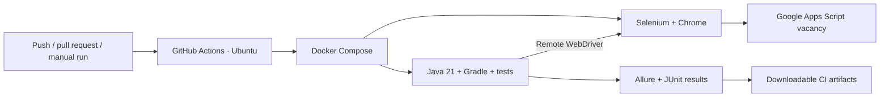

<div align="center">

# Celadon · UI Test Automation

### From browser checks to a Docker-based CI pipeline

A Java QA portfolio project for the **Celadon Junior QA vacancy page**.

[](https://github.com/NikolayKossov/celadon-qa-ui-tests/actions/workflows/ui-tests.yml)


[View the tested page](https://script.google.com/macros/s/AKfycbz8yTu7kqG8DrmWSIqzn4-ze9Q-iQHKVuNzvvL8NFYAyvKeIsmabCWvBGnCsjUTHL-aqw/exec) · [Explore CI runs](https://github.com/NikolayKossov/celadon-qa-ui-tests/actions) · [Browse the tests](src/test/java/tests/celadon/CeladonVacancyTest.java)

</div>

---

## 👋 About the project

This project checks the information a candidate needs before applying: the role, requirements, benefits and contact links. It demonstrates how a small UI test suite can be structured, run in containers and connected to continuous integration.

**11 test cases · Page Object pattern · Two nested iframes · Allure evidence**

The application is hosted in Google Apps Script. Tests enter both iframe layers before interacting with the vacancy page, using Selenide's built-in waits instead of fixed delays.

## 📑 Contents

- [Technologies and tools](#-technologies-and-tools)
- [Implemented checks](#-implemented-checks)
- [Automation architecture](#-automation-architecture)
- [GitHub Actions](#-github-actions)
- [Allure reports](#-allure-reports)
- [Run locally](#-run-locally)
- [Run with Docker](#-run-with-docker)
- [Project structure](#-project-structure)
- [Scope and next steps](#-scope-and-next-steps)

## 🛠 Technologies and tools

| Technology | Role in this project |
| --- | --- |
| **Java 21** | Test implementation and container runtime |
| **Selenide / Selenium WebDriver** | Browser automation, element assertions and automatic waits |
| **JUnit 5** | Test lifecycle, parameterized cases and assertions |
| **Gradle Wrapper** | Repeatable build and dependency management |
| **Allure Report** | Test steps, screenshots and page-source attachments |
| **Docker Compose** | Separate test-runner and Chrome containers |
| **GitHub Actions** | CI execution on a GitHub-hosted Ubuntu runner |

## 🧪 Implemented checks

| Area | What is verified | Cases |
| --- | --- | :---: |
| Vacancy overview | Junior QA title, Poland, remote/full-time format and B1+ English | 1 |
| Candidate requirements | GUI/UI/UX testing, API testing, web architecture, English and optional experience | 1 |
| Benefits | All six advertised benefits are visible | 1 |
| Application instructions | Email recipient, mailto subject and displayed subject instruction | 1 |
| Navigation and contacts | Cases, About, Website, LinkedIn, Privacy Policy, Telegram and email destinations | 7 |
| **Total** | **Four individual tests and seven parameterized cases** | **11** |

Each test starts with a fresh browser session. Screenshots and application-frame HTML are attached after execution, and the browser is closed in a `finally` block.

## 🔄 Automation architecture



Compose waits for Chrome's health check before starting the suite. The test container returns a failing exit code when tests fail and still attempts to generate Allure. CI collects diagnostics and stops the containers after the run.

## ⚙️ GitHub Actions

[Open the workflow and run history](https://github.com/NikolayKossov/celadon-qa-ui-tests/actions/workflows/ui-tests.yml)

The workflow runs on pushes to `main`, pull requests targeting `main`, and manual requests.

**To launch a demo:** open **Actions → Docker UI tests → Run workflow → main**.

The job checks out the repository, builds the Docker image, runs the tests and uploads results. The badge at the top reflects the workflow status; open an individual run for its actual outcome.

Artifacts are retained for **14 days**, including when a test fails. No personal server is required.

## 📊 Allure reports

Allure provides readable test steps and diagnostic evidence for investigating failures.

| Output | Location |
| --- | --- |
| Generated Allure HTML | `build/reports/allure-report/allureReport/` |
| Raw Allure results and attachments | `build/allure-results/` |
| Gradle test report | `build/reports/tests/test/index.html` |
| JUnit XML | `build/test-results/test/` |

**In GitHub Actions:** open a completed run and download **Artifacts → ui-test-results-N**. The archive includes reports, screenshots, HTML attachments and Docker logs. Serve the extracted Allure HTML directory over HTTP to view it; it is not published as a live GitHub Pages site.

**After a local run:**

```powershell
.\gradlew.bat allureServe
```

Keep the terminal open while viewing the report. Stop the server with `Ctrl+C`.

## 🚀 Run locally

Requirements: **JDK 17+** (validated locally with JDK 21), Chrome and internet access. Gradle Wrapper downloads Gradle; Selenium Manager resolves the browser driver.

```powershell
# Windows: visible browser
.\gradlew.bat test

# Headless run and report generation
.\gradlew.bat test allureReport '-Dheadless=true' --rerun-tasks
```

```bash
# Linux / macOS
sh gradlew test allureReport -Dheadless=true --rerun-tasks
```

| Property | Example / default |
| --- | --- |
| `headless` | `false` locally; `true` in Docker |
| `browser` | `chrome` |
| `browser_size` | `1440x1000` |
| `remote_url` | Optional Selenium endpoint, e.g. `http://localhost:4444/wd/hub` |
| `celadon.url` | Defaults to the vacancy URL linked above |
| `browser_version` | Optional remote browser version |

`test` and `celadon_test` both run this suite. Use `--rerun-tasks` to force a fresh execution.

## 🐳 Run with Docker

Requirements: **Docker Engine / Docker Desktop**, **Compose v2**, Linux containers and an x86-64 host. Host Java and Chrome installations are not required.

**Windows PowerShell:**

```powershell
New-Item -ItemType Directory -Force build | Out-Null
docker compose up --build --abort-on-container-exit --exit-code-from tests
docker compose down --remove-orphans
```

**Linux:**

```bash
mkdir -p build
export LOCAL_UID=$(id -u) LOCAL_GID=$(id -g)
docker compose up --build --abort-on-container-exit --exit-code-from tests
docker compose down --remove-orphans
```

Results remain in the host `build` directory. Generated evidence from the previous run is cleared before testing. The Selenium port is used within the Compose network and is not exposed on the host.

To serve the generated report using Docker on Windows:

```powershell
docker run --rm -p 127.0.0.1:8088:80 --mount "type=bind,source=$((Get-Location).Path)/build/reports/allure-report/allureReport,target=/usr/share/nginx/html,readonly" nginx:stable-alpine
```

Open [localhost:8088](http://localhost:8088); stop with `Ctrl+C`.

## 📁 Project structure

```text
.github/workflows/ui-tests.yml       GitHub Actions pipeline
src/test/java/
├── pages/CeladonVacancyPage.java     Page Object and Allure steps
└── tests/celadon/
    ├── CeladonTestBase.java         Configuration, evidence and cleanup
    └── CeladonVacancyTest.java      Test scenarios and link parameters
Dockerfile                          Java test-runner image
compose.yaml                        Test runner + Selenium Chrome
docker/run-tests.sh                 Test execution and report generation
Jenkinsfile                         Optional Jenkins pipeline
build.gradle                        Dependencies and test tasks
```

<details>
<summary><b>Optional Jenkins configuration</b></summary>

The repository also includes a Jenkins pipeline, but Jenkins deployment has not been validated for this project. GitHub Actions is the primary CI path.

To use Jenkins, provide a Linux agent labelled `docker` with Docker CLI, Compose v2 and access to the Docker daemon. Install Pipeline, Git, JUnit and Allure plugins, configure Allure Commandline and Java, and create a Pipeline from SCM using `Jenkinsfile`. The pipeline clears its workspace before checkout, runs Compose, archives results and shuts down containers.

</details>

## 🎯 Scope and next steps

This is a focused UI automation portfolio, built around a static vacancy page. Link checks verify destinations, not the availability of external websites. Email links are inspected without sending applications. Screenshots provide evidence rather than visual-regression comparisons.

The local baseline passed **11/11 tests** on 6 September 2026 with JDK 21 and Chrome 153. Consult GitHub Actions for CI results. A narrow viewport can be configured, but a dedicated mobile suite has not been validated.

Potential extensions include publishing Allure to GitHub Pages and adding accessibility checks. Form validation and API testing would require a suitable application with those features.

---

**Author:** [Nikolay Kossov](https://github.com/NikolayKossov) · QA automation portfolio
